# Content Verification

Verification proves that you own the content you've published to ATProto. This is done through `.well-known` endpoints and `<link>` tags.

## Why Verify?

Verification allows platforms like Leaflet and WhiteWind to:

1. Confirm you control the content you claim to have published
2. Prevent impersonation
3. Enable features that require ownership proof
4. Build trust in the federated ecosystem

## Quick Start

### 1. Create .well-known Endpoint

Create a SvelteKit endpoint at `.well-known/site.standard.publication`:

```typescript
// src/routes/.well-known/site.standard.publication/+server.ts
import { text } from '@sveltejs/kit';
import { generatePublicationWellKnown } from 'svelte-standard-site/verification';

export function GET() {
	return text(
		generatePublicationWellKnown({
			did: 'did:plc:your-did-here',
			publicationRkey: '3abc123xyz789' // From publication creation
		})
	);
}
```

### 2. Verify It Works

```bash
curl https://yourblog.com/.well-known/site.standard.publication
# Should output: at://did:plc:xxx/site.standard.publication/3abc123xyz789
```

### 3. Add Link Tag (Optional)

Add verification to individual documents:

```svelte
<!-- src/routes/blog/[slug]/+page.svelte -->
<script lang="ts">
	import { generateDocumentLinkTag } from 'svelte-standard-site/verification';

	const { data } = $props();
</script>

<svelte:head>
	{@html generateDocumentLinkTag({
		did: 'did:plc:xxx',
		documentRkey: data.rkey
	})}
</svelte:head>
```

## Functions

### generatePublicationWellKnown

Generate content for the `.well-known` endpoint:

```typescript
import { generatePublicationWellKnown } from 'svelte-standard-site/verification';

const content = generatePublicationWellKnown({
	did: 'did:plc:xxx',
	publicationRkey: '3abc123xyz'
});
// Returns: "at://did:plc:xxx/site.standard.publication/3abc123xyz"
```

### generateDocumentLinkTag

Generate a `<link>` tag for a specific document:

```typescript
import { generateDocumentLinkTag } from 'svelte-standard-site/verification';

const tag = generateDocumentLinkTag({
	did: 'did:plc:xxx',
	documentRkey: '3xyz789abc'
});
// Returns: '<link rel="site.standard.document" href="at://...">'
```

### generatePublicationLinkTag

Generate a `<link>` tag for your publication:

```typescript
import { generatePublicationLinkTag } from 'svelte-standard-site/verification';

const tag = generatePublicationLinkTag({
	did: 'did:plc:xxx',
	publicationRkey: '3abc123xyz'
});
```

### verifyPublicationWellKnown

Programmatically verify a site's `.well-known` endpoint:

```typescript
import { verifyPublicationWellKnown } from 'svelte-standard-site/verification';

const isValid = await verifyPublicationWellKnown(
	'https://example.com',
	'did:plc:xxx',
	'3abc123xyz'
);

if (isValid) {
	console.log('Site is verified!');
}
```

## Complete Setup

### Get Your Publication Rkey

When you create a publication, save the rkey:

```typescript
import { StandardSitePublisher } from 'svelte-standard-site/publisher';

const publisher = new StandardSitePublisher({
	identifier: 'you.bsky.social',
	password: process.env.ATPROTO_APP_PASSWORD!
});

await publisher.login();

const result = await publisher.publishPublication({
	name: 'My Blog',
	url: 'https://yourblog.com'
});

// Save these!
console.log('DID:', publisher.getDid());
console.log('Rkey:', result.uri.split('/').pop());
```

### Store in Environment Variables

```env
# .env
PUBLIC_ATPROTO_DID=did:plc:xxx
PUBLIC_PUBLICATION_RKEY=3abc123xyz
```

### Create Endpoint

```typescript
// src/routes/.well-known/site.standard.publication/+server.ts
import { text } from '@sveltejs/kit';
import { generatePublicationWellKnown } from 'svelte-standard-site/verification';
import { PUBLIC_ATPROTO_DID, PUBLIC_PUBLICATION_RKEY } from '$env/static/public';

export function GET() {
	return text(
		generatePublicationWellKnown({
			did: PUBLIC_ATPROTO_DID,
			publicationRkey: PUBLIC_PUBLICATION_RKEY
		}),
		{
			headers: {
				'Content-Type': 'text/plain',
				'Cache-Control': 'public, max-age=3600'
			}
		}
	);
}
```

### Add to Site Header

```svelte
<!-- src/routes/+layout.svelte -->
<script lang="ts">
	import { generatePublicationLinkTag } from 'svelte-standard-site/verification';
	import { PUBLIC_ATPROTO_DID, PUBLIC_PUBLICATION_RKEY } from '$env/static/public';
</script>

<svelte:head>
	{@html generatePublicationLinkTag({
		did: PUBLIC_ATPROTO_DID,
		publicationRkey: PUBLIC_PUBLICATION_RKEY
	})}
</svelte:head>
```

## Document Verification

For individual blog posts:

### Store Document Rkeys

When publishing, save the mapping:

```typescript
// In your publish script
const result = await publisher.publishDocument({
	// ... document data
});

// Save mapping: slug -> rkey
const mapping = {
	'my-first-post': result.uri.split('/').pop(),
	'another-post': '3xyz789abc'
	// etc.
};

fs.writeFileSync('document-rkeys.json', JSON.stringify(mapping));
```

### Add to Document Pages

```svelte
<!-- src/routes/blog/[slug]/+page.svelte -->
<script lang="ts">
	import { generateDocumentLinkTag } from 'svelte-standard-site/verification';
	import documentRkeys from '$lib/document-rkeys.json';

	const { data } = $props();
	const rkey = documentRkeys[data.slug];
</script>

<svelte:head>
	{#if rkey}
		{@html generateDocumentLinkTag({
			did: 'did:plc:xxx',
			documentRkey: rkey
		})}
	{/if}
</svelte:head>
```

## AT-URI Utilities

### Build AT-URIs

```typescript
import { getDocumentAtUri, getPublicationAtUri } from 'svelte-standard-site/verification';

const docUri = getDocumentAtUri('did:plc:xxx', '3xyz789abc');
// "at://did:plc:xxx/site.standard.document/3xyz789abc"

const pubUri = getPublicationAtUri('did:plc:xxx', '3abc123xyz');
// "at://did:plc:xxx/site.standard.publication/3abc123xyz"
```

### Parse AT-URIs

```typescript
import { parseAtUri } from 'svelte-standard-site/verification';

const parsed = parseAtUri('at://did:plc:xxx/site.standard.document/3xyz');

if (parsed) {
	console.log(parsed.did); // "did:plc:xxx"
	console.log(parsed.collection); // "site.standard.document"
	console.log(parsed.rkey); // "3xyz"
}
```

### Extract from HTML

```typescript
import { extractDocumentLinkFromHtml, extractPublicationLinkFromHtml } from 'svelte-standard-site/verification';

const html = await fetch('https://example.com/post').then((r) => r.text());

const docUri = extractDocumentLinkFromHtml(html);
// "at://did:plc:xxx/site.standard.document/3xyz"

const pubUri = extractPublicationLinkFromHtml(html);
// "at://did:plc:xxx/site.standard.publication/3abc"
```

## Verification Flow

1. **Publish** a publication to ATProto
2. **Save** the DID and rkey
3. **Create** `.well-known` endpoint returning the AT-URI
4. **Optionally** add `<link>` tags to your HTML
5. **Platforms** fetch your `.well-known` endpoint to verify ownership

```mermaid
sequenceDiagram
    participant You
    participant ATProto
    participant Platform
    
    You->>ATProto: Publish publication
    ATProto->>You: Return AT-URI
    You->>Your Site: Add .well-known endpoint
    Platform->>Your Site: Fetch .well-known
    Your Site->>Platform: Return AT-URI
    Platform->>ATProto: Verify AT-URI exists
    ATProto->>Platform: Confirmed
    Platform->>Platform: Mark as verified ✓
```



## Troubleshooting

### .well-known Returning 404

SvelteKit requires special handling for `.well-known`:

```typescript
// Option 1: Create the exact path
// src/routes/.well-known/site.standard.publication/+server.ts

// Option 2: Use static files
// static/.well-known/site.standard.publication
```

If using static files, make sure your hosting platform allows `.well-known`.

### Wrong MIME Type

Ensure you're returning `text/plain`:

```typescript
export function GET() {
	return text(content, {
		headers: {
			'Content-Type': 'text/plain'
		}
	});
}
```

### CORS Issues

If platforms can't access your endpoint:

```typescript
export function GET() {
	return text(content, {
		headers: {
			'Content-Type': 'text/plain',
			'Access-Control-Allow-Origin': '*'
		}
	});
}
```

### Verification Failing

Use the verification utility to test:

```typescript
const isValid = await verifyPublicationWellKnown(
	'https://yourblog.com',
	'did:plc:xxx',
	'3abc123xyz'
);

if (!isValid) {
	// Check:
	// 1. .well-known endpoint is accessible
	// 2. Returns exact AT-URI
	// 3. No extra whitespace
	// 4. Correct MIME type
}
```

## Best Practices

1. **Use environment variables** - Don't hardcode DIDs/rkeys
2. **Add caching headers** - `.well-known` content doesn't change often
3. **Test before deploying** - Verify the endpoint works
4. **Keep rkeys secure** - Don't expose in client code unnecessarily
5. **Monitor** - Check that verification keeps working after deploys

## Hosting Platform Notes

### Vercel

Works out of the box. No special configuration needed.

### Netlify

Add to `netlify.toml`:

```toml
[[redirects]]
  from = "/.well-known/site.standard.publication"
  to = "/.well-known/site.standard.publication/index.html"
  status = 200
```

### Cloudflare Pages

Works by default. Consider adding a cache rule for `.well-known`.

### GitHub Pages

Static files work, but SvelteKit endpoints don't. Use the static file approach.

## Next Steps

- [Publishing](./publishing.md)
- [Content Transformation](./content-transformation.md)
- [Comments](./comments.md)
